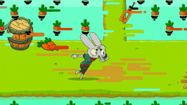

  

# 👋 Hi, I'm Ishaan Singh

### 🤖 Machine Learning & AI Developer
### 🚀 Building Intelligent Applications with AI, NLP & Full-Stack Technologies

---

  

## 🌐 Connect With Me

---

# 📊 GitHub Statistics
 

# 🔥 GitHub Streak

---
## 🟡 Pacman Contribution Graph

  

# 👀 Visitor Count

---

### ⚡ "Building AI Solutions That Solve Real Problems"

⭐ If you like my projects, consider starring them.

