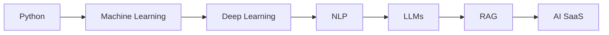

# 👋 Hi, I'm Ishaan Singh

### 🤖 Machine Learning & AI Developer
### 🚀 Building Intelligent Applications with AI, NLP & Full-Stack Technologies

---

## 🚀 About Me

🎓 B.Tech CSE (Data Science) @ Gautam Buddha University

🤖 Passionate about Artificial Intelligence, Machine Learning & NLP

🌱 Currently Learning:
- Large Language Models (LLMs)
- Retrieval Augmented Generation (RAG)
- MLOps
- Cloud AI Deployment

🔭 Current Projects:
- AI Medicine Normalizer
- Investment Comparison Tool
- Intelligent Search Systems

💡 Goal:
- Build Production-Ready AI SaaS Products
- Become an AI/ML Engineer

---

## 🌐 Connect With Me

---

# 💻 Tech Stack

## Languages

---

## AI / ML

---

## Frontend

---

## Backend

---

## Database

---

# 📊 GitHub Statistics

---

# 🔥 GitHub Streak

---
# 📚 Learning Journey

---

# 🐍 Contribution Snake

---

# 👀 Visitor Count

---

### ⚡ "Building AI Solutions That Solve Real Problems"

⭐ If you like my projects, consider starring them.

